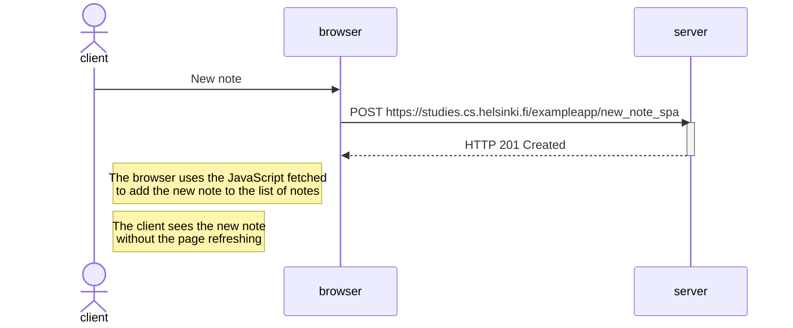

```mermaid
sequenceDiagram
    actor client
    client->>browser: New note
    browser->>server: POST https://studies.cs.helsinki.fi/exampleapp/new_note_spa
    activate server
    server-->>browser: HTTP 201 Created
    deactivate server
    Note left of browser: The browser uses the JavaScript fetched <br/>to add the new note to the list of notes
    Note right of client: The client sees the new note <br/>without the page refreshing

```