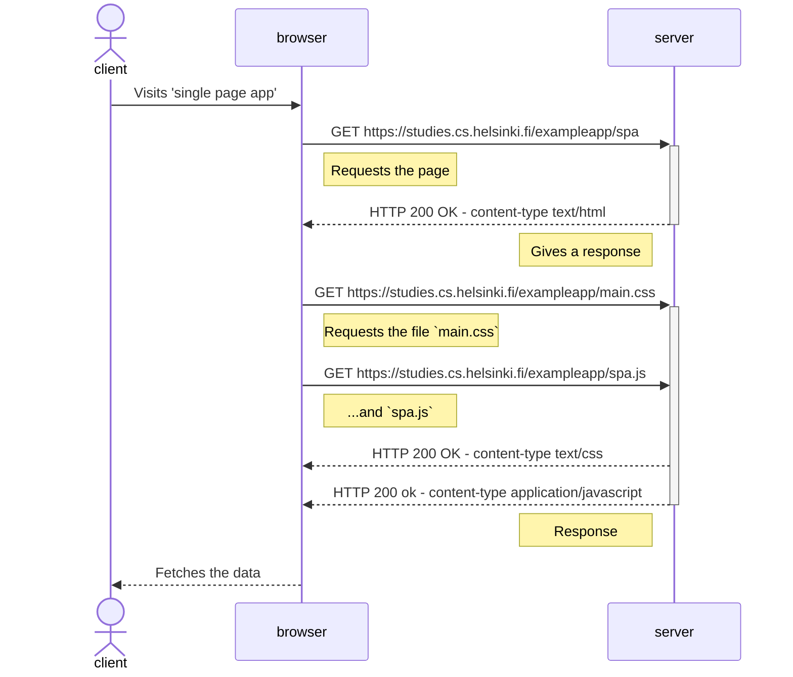

```mermaid
sequenceDiagram

actor client

client ->> browser: Visits 'single page app'

browser ->> +server: GET https://studies.cs.helsinki.fi/exampleapp/spa
Note right of browser: Requests the page
server -->> -browser: HTTP 200 OK - content-type text/html
Note left of server: Gives a response

browser ->> +server: GET https://studies.cs.helsinki.fi/exampleapp/main.css
Note right of browser: Requests the file `main.css`
browser ->> server: GET https://studies.cs.helsinki.fi/exampleapp/spa.js
Note right of browser: ...and `spa.js`
server -->> browser: HTTP 200 OK - content-type text/css
server -->> -browser: HTTP 200 ok - content-type application/javascript
Note left of server: Response
browser -->> client: Fetches the data
```